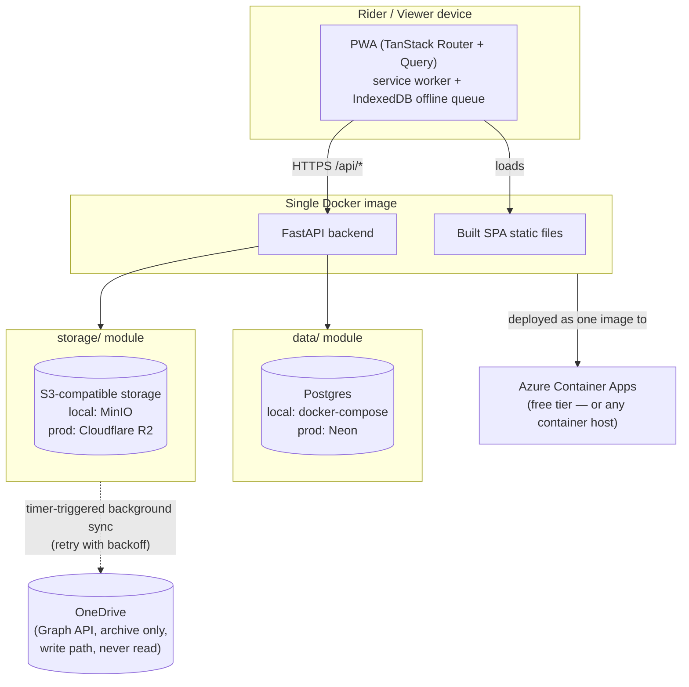

# Architecture Diagram

Reference for every agent to check the build is still tracking the intended shape (spec Section 10). If a change makes this diagram wrong, update the diagram in the same patch — it should never describe a system that no longer exists.

**What this diagram is asserting, so a drift is easy to spot:**
- Exactly one deployable artifact (the container) — not separate frontend/backend hosting.
- The app's only synchronous read/write dependencies are Postgres and the S3-compatible store — OneDrive is a one-way, best-effort background arrow, never something a request waits on.
- `data/` and `storage/` are the only modules allowed to know which concrete provider (Neon vs local Postgres, R2 vs MinIO) they're talking to (spec Section 4, "Portability principle").
