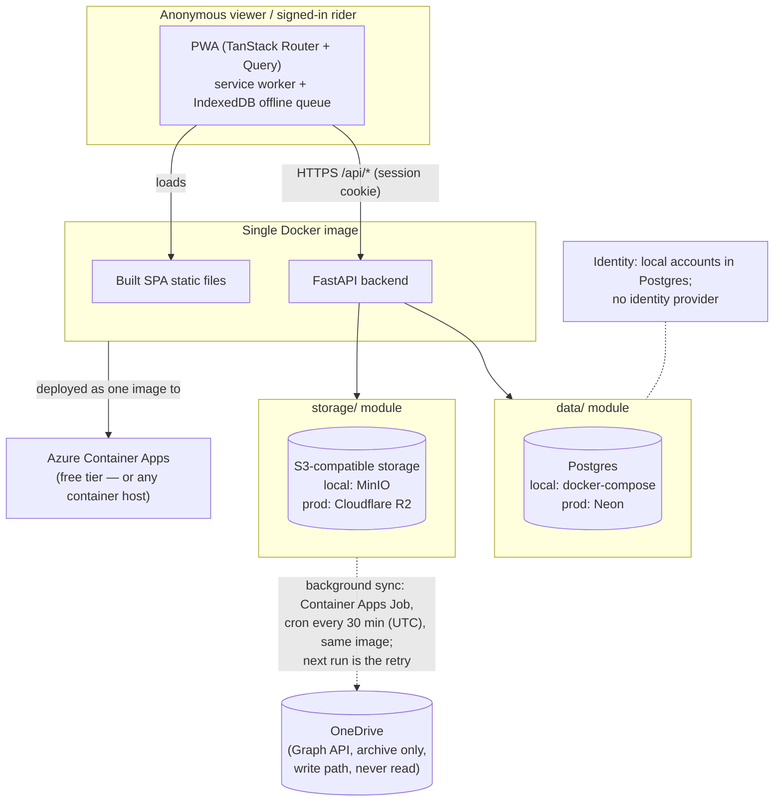

# Architecture Diagram

Reference for every agent to check the build is still tracking the intended shape (spec Section 10). If a change makes this diagram wrong, update the diagram in the same patch — it should never describe a system that no longer exists.

**What this diagram is asserting, so a drift is easy to spot** (the three invariants below are **unchanged** by decision-log Entry 29, the accounts and membership model):
- Exactly one deployable artifact (the container) — not separate frontend/backend hosting. The OneDrive sync's scheduled Container Apps Job (`t-onedrive-sync-scheduler`, `infra/azure/README.md`) does not break this: it runs the same image with its command overridden, and every deploy moves the app and the job to the same tag.
- The app's only synchronous read/write dependencies are Postgres and the S3-compatible store — OneDrive is a one-way, best-effort background arrow, never something a request waits on.
- `data/` and `storage/` are the only modules allowed to know which concrete provider (Neon vs local Postgres, R2 vs MinIO) they're talking to (spec Section 4, "Portability principle").

**Access model (decision-log Entry 29; not an invariant, but the diagram should match it):**
- Authorization is a session plus trip membership. The session is an opaque cookie whose hash is stored in Postgres, and membership is read from Postgres on every request. No slug is a write credential. Rate limiting is in-process (`core/ratelimit.py`), and the deployment is single-replica. Going to more than one replica means moving the rate limits to Postgres first (triggered debt, Entry 29).
